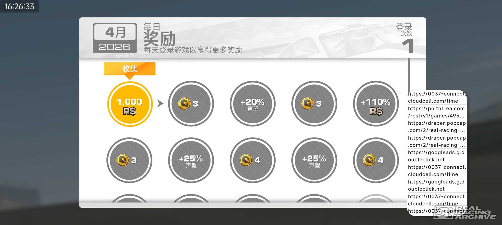
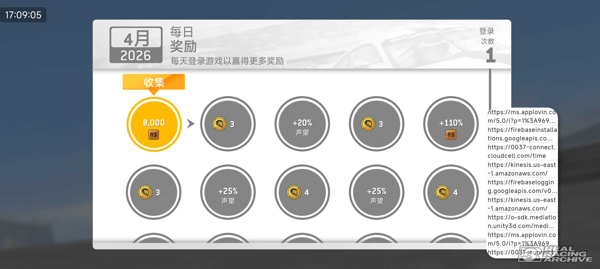

# RealRacingPin

[English](README.md) | 中文

真实赛车3联网验证软件。基于[ProxyPin](https://github.com/wanghongenpin/proxypin)v1.2.7。

您也可以使用它来拦截、查看和修改HTTP(S)流量。

---

## 核心功能

- 开启抓包后，自动回应真实赛车3的服务器联网验证。

- 时间戳偏移（用于开启轮次中心过去的比赛，或者单纯整活）

## 示例

- 7.6.0 版本签到

- 14.0.1 版本签到

- 时光机（截图时，手机时间为 2026-04-17T19:24:35.013）

## 下载地址

目前在进行30天的alpha测试。如果一切正常，将放入Github Release。

**目前可在使用文档中获取下载链接**。

## 详细使用教程

[点此查看使用文档](https://ycna0fgq1dzb.feishu.cn/wiki/ZQxVwLU70ink4vkwU8hcRFk8nEc)

## 致谢

- 项目[ProxyPin](https://github.com/wanghongenpin/proxypin)，以及它的所有作者。

- 所有致力于研究《真实赛车3》的车手。

## Todo

- 修改逻辑，使得在飞行模式下也能开启抓包。